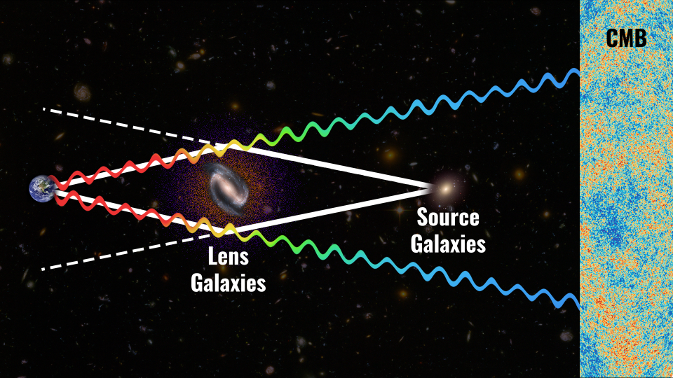

# glasz


**glasz** is a package designed to aid in joint analyses of kSZ+GGL. For more
information, please read Sunseri et al. 2025 (in prep). This code is built on
`pyccl` and was derived from the work done in
[Amodeo et al. 2021](https://arxiv.org/pdf/2009.05558).

Authors: James Sunseri



```{include} ../README.md
:start-after: <!-- SPHINX-START -->
```

```{toctree}
:maxdepth: 2
:caption: Getting Started
:hidden:

notebooks/tutorial
notebooks/profiles
notebooks/kSZ
notebooks/GGL
notebooks/halo_model
notebooks/two-halo
```

```{toctree}
:maxdepth: 2
:caption: API
:hidden:

api/glasz
```
